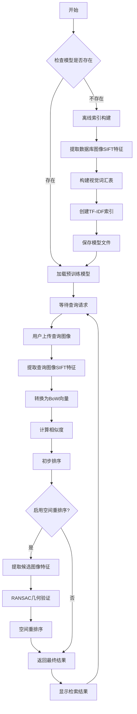

# 图像检索系统项目文档

## 文档整体框架

```
1. 系统功能描述
   - 系统概述
   - 主要功能
   - 技术特点

2. 项目代码架构（系统设计）
   - 模块组织结构
   - 核心组件说明
   - 数据流向

3. 工作流程
   - 文字描述
   - Mermaid流程图

4. 核心算法设计
   - SIFT特征提取
   - 视觉词汇构建
   - TF-IDF索引
   - 空间重排序

5. 系统实现
   - 算法实现
   - 界面实现
```

---

## 1. 系统功能描述

### 1.1 系统概述

该图像检索系统是基于视觉词袋（Bag-of-Words）模型的内容检索系统，采用 SIFT 特征提取和 TF-IDF 加权机制，并集成了空间重排序功能以提高检索精度。系统支持大规模图像数据库的索引构建和实时查询。

### 1.2 主要功能

-   **图像特征提取**：使用 SIFT 算法提取图像关键点和描述符
-   **视觉词汇构建**：通过 K-means 聚类构建视觉词汇表
-   **索引构建**：创建 TF-IDF 加权的倒排索引
-   **相似性检索**：基于视觉词袋模型的图像检索
-   **空间重排序**：使用 RANSAC 进行几何验证，提高检索精度
-   **Web 界面**：基于 Gradio 的用户友好界面

### 1.3 技术特点

-   **可扩展性**：支持大规模图像数据库
-   **高精度**：结合 BoW 和空间验证的双重检索策略
-   **实时性**：预构建索引，支持快速查询
-   **易用性**：Web 界面，支持拖拽上传和实时预览

---

## 2. 项目代码架构（系统设计）

### 2.1 模块组织结构

```
image_retrieval_system/
├── app.py                    # 主应用程序和Gradio界面
├── feature_extractor.py      # SIFT特征提取模块
├── vocabulary_builder.py     # 视觉词汇构建模块
├── indexer.py               # TF-IDF索引构建模块
├── retriever.py             # 图像检索核心模块
├── spatial_verifier.py      # 空间重排序模块
├── utils.py                 # 工具函数模块
├── database_images/         # 图像数据库目录
├── models/                  # 模型存储目录
└── query_images/            # 查询图像目录
```

### 2.2 核心组件说明

| 模块                    | 功能           | 主要类/函数                                                     |
| ----------------------- | -------------- | --------------------------------------------------------------- |
| `feature_extractor.py`  | SIFT 特征提取  | `extract_sift_features()`, `extract_descriptors_for_database()` |
| `vocabulary_builder.py` | 视觉词汇构建   | `build_vocabulary()`                                            |
| `indexer.py`            | 索引构建       | `image_to_bow()`, `create_tfidf_index()`                        |
| `retriever.py`          | 检索核心       | `retrieve_similar_images()`                                     |
| `spatial_verifier.py`   | 空间验证       | `spatial_re_rank()`, `verify_transform()`                       |
| `app.py`                | 系统集成和界面 | `setup_system()`, `search_interface()`                          |

### 2.3 数据流向

```
Raw Images → SIFT Features → Visual Vocabulary → BoW Vectors 
→ TF-IDF Index → Retrieval Results → Spatial Re-ranking → Final Results
```

---

## 3. 工作流程

系统工作流程分为两个主要阶段：

**离线索引构建阶段：**

1. 加载数据库中的所有图像
2. 使用 SIFT 算法提取每张图像的特征描述符
3. 收集所有描述符，使用 K-means 聚类构建视觉词汇表
4. 将每张图像转换为视觉词袋向量
5. 计算 TF-IDF 权重并构建倒排索引
6. 保存模型文件以供后续查询使用

**在线查询阶段：**

1. 用户上传查询图像
2. 提取查询图像的 SIFT 特征
3. 使用预构建的词汇表将查询图像转换为 BoW 向量
4. 计算与数据库中所有图像的相似度
5. 返回初步检索结果
6. 可选：对候选结果进行空间重排序验证
7. 返回最终排序结果



---

## 4. 核心算法设计

### 4.1 SIFT 特征提取

**算法原理：**

-   使用尺度不变特征变换（SIFT）算法
-   检测图像中的关键点和局部特征描述符
-   每个描述符为 128 维向量

**实现要点：**

```python
def extract_sift_features(image_path):
    # 加载图像并转换为灰度
    img = cv2.imread(image_path)
    gray = cv2.cvtColor(img, cv2.COLOR_BGR2GRAY)

    # 创建SIFT检测器
    sift = cv2.SIFT_create()

    # 检测关键点和描述符
    keypoints, descriptors = sift.detectAndCompute(gray, None)

    return keypoints, descriptors, img.shape[:2]
```

### 4.2 视觉词汇构建

**算法原理：**

-   收集所有图像的 SIFT 描述符
-   使用 K-means 聚类算法构建视觉词汇表
-   每个聚类中心代表一个"视觉词"

**实现要点：**

```python
def build_vocabulary(all_descriptors, num_clusters=1000):
    # 使用MiniBatchKMeans提高效率
    kmeans = MiniBatchKMeans(
        n_clusters=num_clusters,
        random_state=42,
        batch_size=1000
    )
    kmeans.fit(all_descriptors)
    return kmeans
```

### 4.3 TF-IDF 索引

**算法原理：**

-   将图像转换为视觉词袋向量
-   计算词频（TF）和逆文档频率（IDF）
-   构建加权的倒排索引

**关键公式：**

-   TF-IDF 权重 = tf(t,d) × idf(t)
-   其中 idf(t) = log(N/df(t))

### 4.4 空间重排序

**算法原理：**

-   使用 RANSAC 算法进行几何验证
-   计算查询图像与候选图像间的仿射变换
-   基于内点数量和 IDF 权重重新排序

**实现流程：**

1. 特征匹配（Lowe's ratio test）
2. RANSAC 几何验证
3. 计算空间得分
4. 重新排序候选结果

---

## 5. 系统实现

### 5.1 算法实现

#### 5.1.1 特征提取实现

```python
class FeatureExtractor:
    def __init__(self):
        self.sift = cv2.SIFT_create()

    def extract_features(self, image_path):
        """提取SIFT特征"""
        try:
            img = cv2.imread(image_path)
            if img is None:
                return None, None, None

            gray = cv2.cvtColor(img, cv2.COLOR_BGR2GRAY)
            keypoints, descriptors = self.sift.detectAndCompute(gray, None)

            return keypoints, descriptors, gray.shape
        except Exception as e:
            print(f"Error extracting features from {image_path}: {e}")
            return None, None, None
```

#### 5.1.2 检索核心实现

```python
def retrieve_similar_images(query_image_path, vocabulary_model,
                          tfidf_transformer, database_tfidf_matrix,
                          database_image_paths, top_n=10):
    """核心检索函数"""
    # 1. 提取查询图像特征
    query_keypoints, query_descriptors, _ = extract_sift_features(query_image_path)

    # 2. 转换为BoW向量
    query_bow = image_to_bow(query_descriptors, vocabulary_model)

    # 3. TF-IDF加权
    query_tfidf = tfidf_transformer.transform([query_bow])

    # 4. 计算相似度
    similarities = cosine_similarity(query_tfidf, database_tfidf_matrix)

    # 5. 排序并返回结果
    sorted_indices = np.argsort(similarities[0])[::-1]

    return [database_image_paths[i] for i in sorted_indices[:top_n]]
```

### 5.2 界面实现

#### 5.2.1 Gradio 界面设计

```python
def create_interface():
    """创建Gradio界面"""
    with gr.Blocks(title="Image Retrieval System") as demo:
        gr.Markdown("# 图像检索系统")

        with gr.Row():
            # 查询图像上传
            query_input = gr.Image(type="filepath", label="查询图像")

            # 控制选项
            spatial_checkbox = gr.Checkbox(
                label="启用空间重排序",
                value=True
            )

        with gr.Row():
            # 结果展示
            gallery_output = gr.Gallery(
                label="检索结果",
                columns=5,
                rows=1
            )

            # 得分信息
            scores_output = gr.Textbox(
                label="相似度得分",
                lines=5
            )

        # 绑定事件
        query_input.upload(
            search_interface,
            inputs=[query_input, spatial_checkbox],
            outputs=[gallery_output, scores_output]
        )

    return demo
```

#### 5.2.2 系统初始化

```python
def setup_system(force_rebuild=False):
    """系统初始化"""
    global vocabulary, tfidf_matrix_db, tfidf_transformer_db, database_image_paths

    # 检查模型文件是否存在
    if not force_rebuild and all_models_exist():
        # 加载预训练模型
        vocabulary = load_model(VOCAB_PATH)
        tfidf_matrix_db = load_model(TFIDF_MATRIX_PATH)
        tfidf_transformer_db = load_model(TFIDF_TRANSFORMER_PATH)
        database_image_paths = load_model(DB_IMAGE_PATHS_PATH)

        return "模型加载成功"
    else:
        # 重新构建索引
        return build_index_from_scratch()
```

#### 5.2.3 交互逻辑

系统提供以下交互功能：

1. **图像上传**：支持拖拽上传或点击选择
2. **实时预览**：上传后立即显示查询图像
3. **参数控制**：可选择是否启用空间重排序
4. **结果展示**：以画廊形式展示检索结果
5. **得分显示**：显示相似度得分和排序信息
6. **模型管理**：支持重建索引和模型

---

## 系统部署和使用

### 环境要求

```
# requirements.txt
gradio==5.31.0
numpy==1.26.4
opencv_contrib_python==4.11.0.86
opencv_python==4.11.0.86
Pillow==11.1.0
scikit_learn==1.6.1
tqdm==4.67.1
```

### 运行步骤

1. 安装依赖包
2. 准备图像数据库
3. 运行 `python app.py`
4. 访问 Web 界面进行查询
